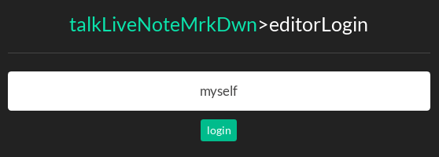
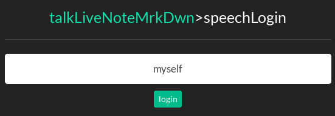
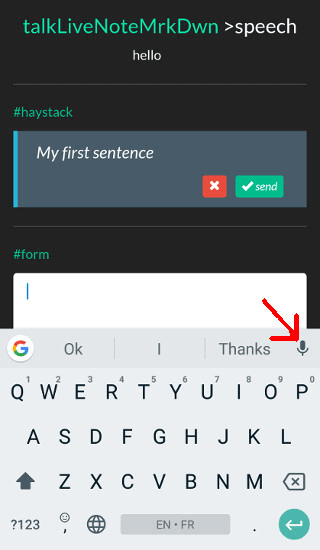
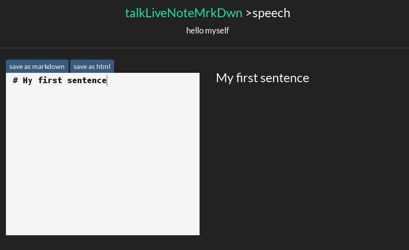

# talkLiveNoteMrkDwn #

A simple text paste over websocket to an editor to ease writing and dictating markdown documents.

## requirements
node v8

## usage ##
```
npm i
PORT=3000 npm start
```

## description ##

* open editor page (choose a login)



* open speech page (use same login) on another device



* input text inside speech page and send it



* text is appending



## todos ##

* not ready for production use
* implement sessions and passwords
* insert text in place instead of appending at the end
* use browser speech recognition ?

## credits ##

includes mardown-it (see https://github.com//markdown-it/markdown-it)

## licence ##

* MIT
* third-parties librairies included and listed below use their respective licences
  - codemirror
  - markdown-it